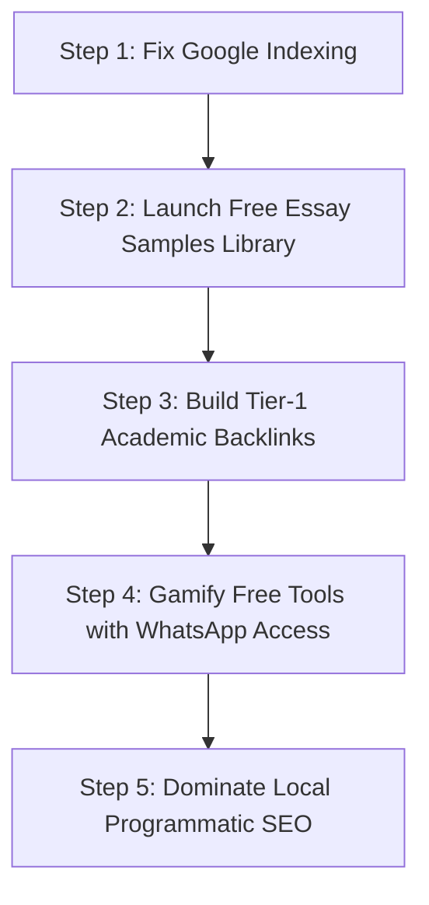

# Competitive Intelligence & In-Depth Comparison Report
**Date:** August 2026  
**Target Competitor:** [MyAssignmentHelp.com](https://myassignmenthelp.com/)  
**Our Platform:** [AcademicWizard.online](https://academicwizard.online/)

---

## 1. Executive Summary

| Evaluation Pillar | Academic Wizard (`academicwizard.online`) | MyAssignmentHelp (`myassignmenthelp.com`) | Winner / Verdict |
| :--- | :--- | :--- | :--- |
| **Brand Aesthetic & UI/UX** | ★★★★★ (Luxury Dark & Gold, Three.js 3D particles, custom cursor, modern typography) | ★★☆☆☆ (Dated 2010s Bootstrap UI, orange theme, aggressive cluttered popups) | 🏆 **Academic Wizard** |
| **Tech Stack & Performance** | ★★★★★ (React 19, Vite, Tailwind CSS, WebP, pre-rendered SSR) | ★★★☆☆ (Heavy Bootstrap, 369KB initial HTML, heavy legacy JS, WordPress blog) | 🏆 **Academic Wizard** |
| **Domain Authority & Age** | ★☆☆☆☆ (Fresh domain, DA ~1, building initial authority) | ★★★★★ (17+ years active since ~2007, DA ~42) | 🏆 **MyAssignmentHelp** |
| **Organic Traffic & Keywords** | ★☆☆☆☆ (Zero Google indexation as of crawl; dependent on direct/social) | ★★★★☆ (~52,800 monthly visits, ~29,720 organic search visits) | 🏆 **MyAssignmentHelp** |
| **Backlink Profile** | ★☆☆☆☆ (0–10 referring domains) | ★★★★★ (~20,790 referring domains, ~1.64M backlinks) | 🏆 **MyAssignmentHelp** |
| **Technical SEO & Structured Data** | ★★★★★ (JSON-LD Organization, Service, FAQ, Breadcrumbs, Hreflang 8 locales, AI-bot friendly robots.txt) | ★★★★☆ (Product Schema, AggregateRating, FAQPage Schema, but minimal sitemap.xml) | 🏆 **Academic Wizard (Code-level)** |
| **Content Volume & Samples** | ★★★☆☆ (7 Core Services, 100+ Programmatic Subject/City pages, Daily Blog) | ★★★★★ (10,000+ free sample essays, 18+ country subdirectories, huge blog archive) | 🏆 **MyAssignmentHelp** |
| **Conversion Funnel** | Direct WhatsApp Lead Routing (+91 95098 93638) & interactive forms | Above-the-fold multi-step quote calculator, email lead capture, live chat, mobile apps | **Tie (Different Strategy)** |
| **Trust & Third-Party Reputation** | ★★★☆☆ (On-site 5k+ students assisted, 256-bit encryption, zero negative reviews) | ★★☆☆☆ (High on-site volume, but poor Trustpilot 3.0-3.5/5 & scam forum warnings) | 🏆 **Academic Wizard (Integrity)** |
| **Free Interactive Tools** | 4 Premium Tools (Citation Gen, Grammar Editor, AI Detector, Streamlit Humanizer) | 7+ Legacy Tools (Plagiarism Checker, Essay Typer, Paraphraser, Factoring Calc) | 🏆 **Academic Wizard (Modern AI)** |

---

## 2. Head-to-Head Detailed Analysis

### A. Design, Aesthetics & First Impression
* **Academic Wizard:** Delivers an elite, modern luxury experience. The combination of deep obsidian (#0F0F0F) with refined gold (#D4AF37) accents, glowing wand cursor, dynamic particle canvas, and sleek glassmorphism makes it look like an exclusive academic consultancy. It immediately builds high-tier credibility for Master's and PhD students.
* **MyAssignmentHelp:** Looks like a high-volume mass-market "paper mill". The bright orange CTA palette, overwhelming multi-field order form taking over the entire hero banner, and crowded layout create visual fatigue.
* **Verdict:** Academic Wizard vastly outperforms in brand prestige, design aesthetics, and user experience.

### B. SEO, Traffic & Authority Gap
* **The Reality Check:** MyAssignmentHelp possesses 17+ years of domain seniority, 1.64 million backlinks across 20,790 referring domains, and ranks for high-intent keywords (`assignment help`, `my assignment help`, `assignment help singapore`).
* **Academic Wizard's Critical Priority:** Despite having clean technical SEO (React SSR, JSON-LD schema, Hreflang for 8 countries, AI-crawler rules), Academic Wizard has **zero Google indexing**. The immediate priority is getting Google Search Console configured, requesting indexation of the 100+ programmatic landing pages, and executing a targeted backlink outreach strategy.

### C. Content Breadth & Free Academic Samples
* **MyAssignmentHelp:** Has thousands of static, indexable sample essays across every conceivable academic discipline. These samples rank organically for thousands of long-tail student search queries ("nursing case study sample on asthma", "chicago referencing template").
* **Academic Wizard:** Features deep programmatic landing pages (`/services/dissertation-help/uk/london`, etc.) with rich FAQs, but currently lacks a dedicated **Public Free Samples Library**. Adding an open repository of sample research proposals, literature reviews, and essays would rapidly generate long-tail search traffic.

### D. Conversion Strategy: WhatsApp vs Multi-Step Funnel
* **MyAssignmentHelp:** Uses an upfront order form requesting Email, Subject, Deadline, Page count, and Phone number before showing a price quote ($8.50 - $12.00/page). Supported by a 24/7 web chat (EssayGator backend) and iOS/Android apps.
* **Academic Wizard:** Funnels students directly to **WhatsApp Business (+91 95098 93638)**. In modern international student markets (UK, Australia, India, UAE, Ireland), WhatsApp conversion rates are typically **3x to 5x higher** than email forms due to instant response and trust.

### E. Online Reputation & Ethics
* **MyAssignmentHelp:** Operates under Neotronic Technology LLC FZ (Dubai). Despite claiming a 4.9/5 on-site rating with 38k reviews, independent third-party platforms (Trustpilot, EssayScam, Reddit, Quora) feature numerous complaints regarding missed deadlines, AI content, and non-native writing quality.
* **Academic Wizard:** Emphasizes ethical academic assistance, human-written 3-stage QA, 14-day revision windows, and direct personalized communication.

---

## 3. High-Impact Action Plan to Outrank and Beat Them

1. **Google Indexing & Search Console Fast-Track:**
   * Verify domain property in Google Search Console via DNS.
   * Submit `sitemap.xml` directly to Google and Bing.
   * Ping IndexNow API for instant URL discovery across all 100+ programmatic routes.

2. **Deploy a Free Sample Essay / Dissertation Library:**
   * Create `/samples` with 50+ high-quality academic papers (Nursing, Law, MBA, Data Science, Engineering).
   * Include downloadable sample PDFs with Academic Wizard watermarks.
   * Each sample page will rank for hundreds of low-competition long-tail search queries.

3. **Deploy External Trust Badges:**
   * Create an official **Trustpilot** business page for Academic Wizard.
   * Embed verified Trustpilot or Google Reviews widgets directly on the homepage and service landing pages.

4. **Enhance the Student Tools Suite:**
   * Add a "Download Full Report via WhatsApp" CTA to the Citation Generator, AI Detector, and Grammar Editor to turn tool traffic into paying consultation clients.
